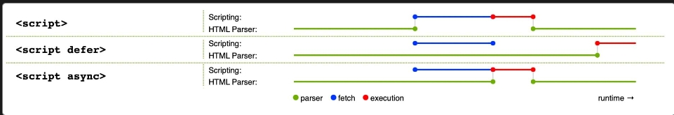
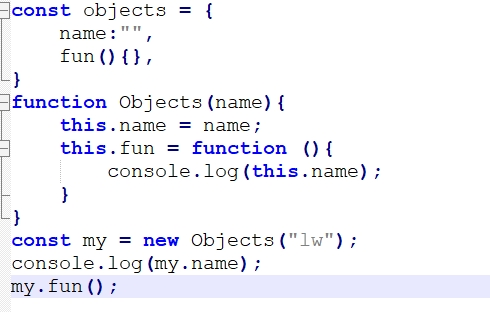

# JavaScript

## 实现方法

- 内部
    - \`
- js的加载策略
    - 假如在html相关的元素没有加载完，就执行了js脚本，则js脚本就会不起作用
    - html是从上往下加载的
    - 预防策略
        - 内部
            - `document.addEventListener("DOMContentLoaded",  ()  =>  { // …});`
            - 它监听浏览器的 `DOMContentLoaded` 事件，其标志了 HTML 文档体完全加载和解析。该代码块中的 JavaScript 在事件被触发后才会运行
        - 外部
            - ``
            - 添加defer属性
- \<script\>\</script\>属性
    - 默认
        - 遇到js脚本，阻塞加载html，而是去加载js并且执行js,然后才继续加载html
    - async
        - 遇到js脚本，再开一个线程加载js，不会阻塞加载html，一旦下载完成，脚本就会执行，从而阻止页面渲染
    - defer
        - 遇到js脚本，再开一个线程加载js，不会阻塞加载html，直到加载完html才执行js
    - 图解
        - 

## 语法

- 运算符
    - `===`:全等
    - `!==`:不相等
- 循环
    - const array = [1,2,3]
    - for(const i of array)
- 变量
    - let
- 常量
    - const
- 变量类型
    - typeof（）查看
    - number
        - `let myAge =  17;`
    - string
        - `let dolphinGoodbye =  "fish";`
        - 单引号、双引号、反引号都可以声明字符串
    - boolean
        - `let iAmAlive =  true;`
    - array
        - `let myNumberArray =  [10,  15,  40];`
    - object
        - `let dog =  {  name:  "Spot",  breed:  "Dalmatian"  };`
        - `dog.name;`
- console.log();
    - 终端打印日志
- 字符串
    - 字符串拼接
        - ${}:`"${one}${two}""`
        - +:`"aa" + "ss"`
    - 数字转字符串
        - `String(myNum2)`
    - 字符串转数字
        - `Number(myString)`
    - 字符串长度
        - str.length
    - 查找子字符串
        - `browserType.indexOf("zilla");`
        - 没有返回-1
    - 截取字符串
        - `browserType.slice(0,  3);`
        - 左闭右开
        - `browserType.slice(2);`：截取2号到尾巴的字符串
    - 转换大小写
        - `radData.toLowerCase();`：所有字符分别转换为小写
        - `radData.toUpperCase();`：所有字符分别转换为大写
    - 字符串替换
        - 不会更新字符串`browserType.replace("moz",  "van");`
        - `browserType = browserType.replace('moz','van');`
        - 要被替换下的字符串和要被替换上的字符串
        - 返回更新后的字符串
- 数组
    - 数组长度
        - `sequence.length;`
    - 字符串转数组：字符串分割
        - `let myArray = myData.split(",");`
    - 数组转字符串
        - `myNewString = myArray.join(",");`
        - `dogNames.toString();`（以逗号连接）
    - 数组添加
        - 作用于数组尾巴
            - `myArray.push("Cardiff");`
            - `myArray.push("Bradford",  "Brighton");`
            - 当方法调用完成时，将返回数组的新长度
        - 作用于数组开头
            - `myArray.unshift("Edinburgh");`
    - 数组删除
        - 作用于数组尾巴
            - `myArray.pop();`
            - 当方法调用完成时，将返回已删除的项目
        - 作用于数组开头
            - `removedItem = myArray.shift();`
- prompt()
    - 要求用户在弹出的对话框中回答一个问题然后将他们输入的文本存储在一个给定的变量中
- 函数
    - function name(){}
    - 匿名函数
        - 没有名字的函数
        - `myButton.onclick  =  function  ()  { alert("hello");};`
- 事件监听器
    - 添加监听器
        - `addEventListener("click",onclick)`
    - 移除监听器
        - `removeEventListener("click",onclick);`
    - 元素的固有属性
        - button.onclick = function;
- 事件对象
    - event
    - 事件对象 `e` 的 `target` 属性始终是事件刚刚发生的元素的引用
    - 键盘事件
        - `window.onkeydown  =  (e)`
        - e.key="a"

## 元素方法

- 创建标签
    - `const newImage = document.createElement('img');`
- 设置标签属性
    - `newImage.setAttribute('src', xxx);`
- 添加标签
    - ` myArticle.appendChild(myH2);`
- 设置文本
    - `myArticle.textContent`

## 对象

- 格式
    - `const objectName =  { member1Name: member1Value, member2Name: member2Value, member3Name: member3Value,};`
    - 成员变量
        - 对象成员的值可以是任意的
    - 成员方法
        - `  bio()  {xx},`
    - 有点像json
        - {}表示一个对象
        - []表示数组
    - 对象的嵌套
        - `const person =  { name:  { first:  "Bob", last:  "Smith", }, // …};`
- 对象属性的访问
    - 点访问
        - `person.age;`
    - 括号访问
        - `person["age"];`
        - 括号表示法一个有用的地方是它不仅可以动态的去设置对象成员的值，还可以动态的去设置成员的名字
        - 可以创建新的成员
- this关键字
- （类外）构造函数
    - 构造函数（function开头）以大写字母开头，并且以它们创建的对象类型命名
    - 使用new调用构造函数并且创建对象
    - 
- 内置属性
    - 所有的对象都有一个内置属性，称为它的 prototype（原型）
    - 除了自己定义的属性还自带其他的属性
- 类
    - `class  Person  {name; constructor(name)  { this.name = name; } introduceSelf()  {}; }}`
    - constructor是构造方法的关键字
- 继承
    - `class  Professor  extends  Person`
- 封装
    - `class  Student  extends  Person  {#year; constructor(name, year)  { super(name); this.#year = year; } introduceSelf()  {console.log(``); } canStudyArchery()  { return  this.#year >  1; }}`
    - #year 是一个私有数据属性
- 私有方法
    - #fun(){}

## JSON

- 简介
    - 一种按照 JavaScript 对象语法的数据格式
    - 通常用于在网站上表示和传输数据
    - JSON 是一种纯数据格式，它只包含属性，没有方法
    - JSON 要求在字符串和属性名称周围使用双引号。单引号无效
- 字符串转json
    - `  const superHeroes =  JSON.parse(str);`
    - 返回转换后的json对象

