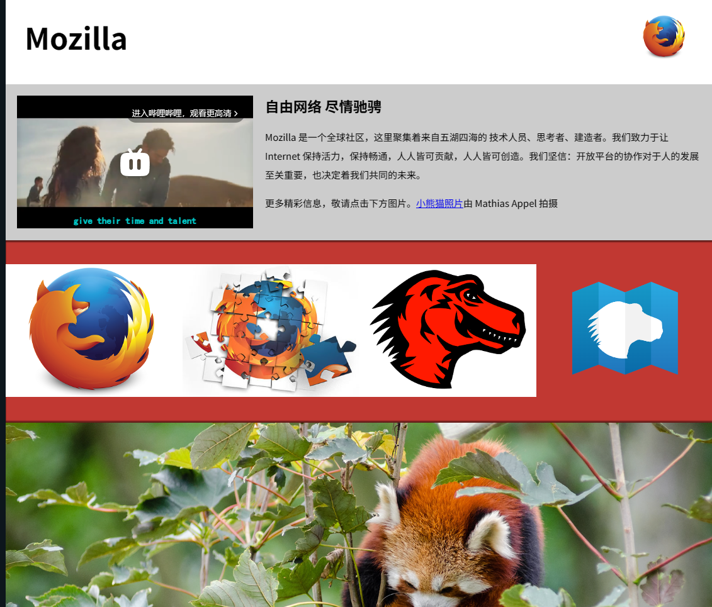
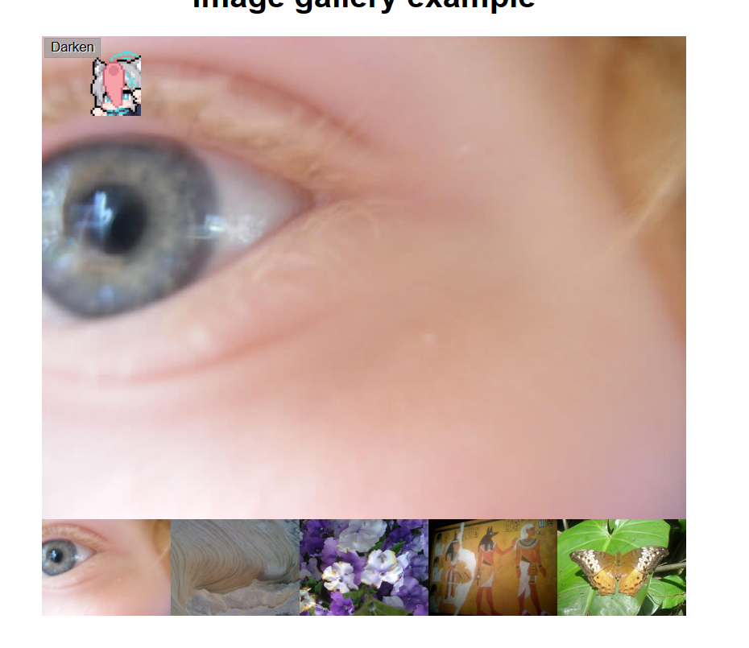
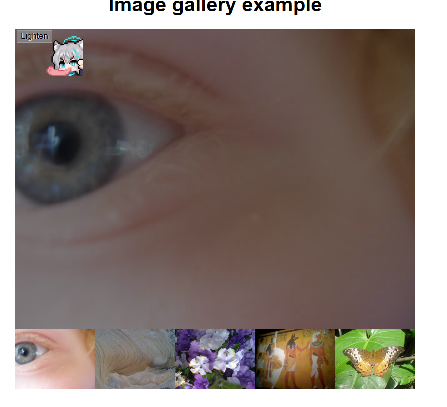

# MDN-Learn
MDN Web Learing,include some demo、big work
## 简介
1. MDN网站的web的学习记录，网站地址：[MDN](https://developer.mozilla.org/zh-CN/docs/Learn/Getting_started_with_the_web "MDN")
2. 学习笔记软件是effie,免费试用版足够满足需求 
3. 每个模块的学习代码分别在html、css、javascript文件夹
4. 每个文件夹下面的lesson1、lesson2分别对于MDN的模块下面小的内容
## HTML
1. html介绍   
    1. 观鸟网demo 
        
2. 多媒体与嵌入 
    1. molliza宣传主页
       
3. html表格
    1. 行星数据
    2. 表格高级特性
## CSS
1. css第一步
    1. 让我们开始css学习之旅---------------------------
       
    3. 个人主页
2. css基础
    1. 样式化表格
    2. 基本的css理解，个人卡片（洛天依）-------------------------------
    3. 一张信纸---------------------------------------------------------------- 
       
    5. 一个盒子-------------------------------------------------------------------------
       
3. 样式化文本
    1. 大学生首页排版
4. css排版
    1. 网格布局
    2. flex盒子
    3. web布局
## javaScript
1. javascript第一步
    1. 猜数字
    2. 笑话生成器
2. javascript基础
    1. 图片库
3. javascript对象
    1. 小球消消乐（可以用鼠标控制去吞噬小球）
