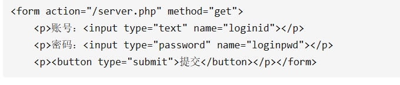
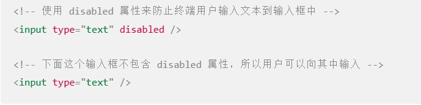
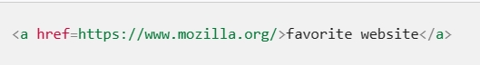
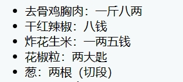
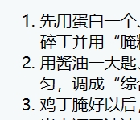
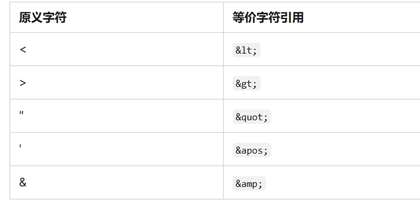
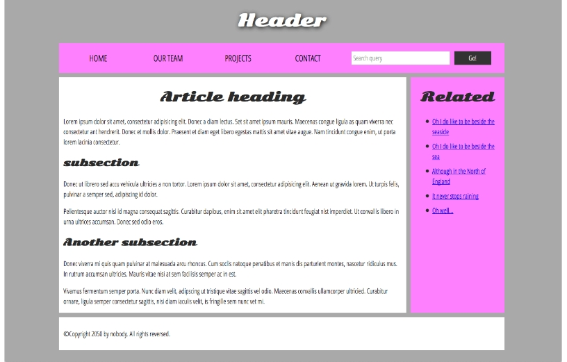
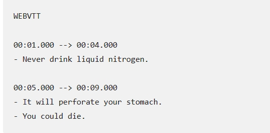
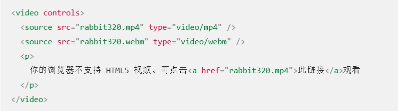

# HTML文件

## Form表单

- 简介
    - 1、form标签对称为表单
    - 2、将表单中的数据，使用指定的请求方式（get或post），提交到指定的服务器地址
- 提交时机
    - 1、点击了表单中的提交按钮
        - 提交是指按钮的type="submit"，而不是显示的文本为提交的按钮
        - type="image"的input标签，也可以实现提交，也可以当做是提交按钮
        - 提交按钮必须放置在表单里面
        - 点击提交按钮时，只会提交它所在的表单
        - 一个页面可以出现多个form表单，但不允许在一个form表单里面出现另一个form表单，不能表单嵌套
    - 2、在js中调用了表单对象的submit方法
        - 获取form表单dom对象
        - 调用dom对象的submit函数
- 请求方式
    - form标签的method属性
        - get
            - 
            - 请求地址（url）：/server.php?loginid=账号文本框内容&loginpwd=密码文本框内容
            - 请求体：无
        - post
            - 请求地址：/server.php
            - 请求体：loginid=账号文本框内容&loginpwd=密码文本框内容
- 请求地址
    - 提交form表单时，会将表单中的数据提交到服务的哪个地址
    - 使用form标签的action属性来设置其提交地址，该属性如果被省略，则默认为当前页面地址
- 发送的数据
    - 1、表单被提交时，表单中的内容并不是全部都会提交
    - 2、提交的数据满足的条件
        - 标签必须具有name属性值
            - 没有name属性值的标签就无法组装键值对，它的值不会被提交
        - 必须是input、select、textarea标签
        - 两个条件都要满足，提交的是键值对，而不是显示的文本

## Html基础

- 标签
    - html是由很多个标签构成的
    - 有开始标签、内容和结束标签
    - html文档声明
        - \<!DOCTYPE html\>: 声明文档类型，需要包含它才能使其他东西正常工作，\<!DOCTYPE html\> 是最短的有效文档声明！
- 元素类别
    - 块级元素
        - 一行一行的东西
    - 内联元素
        - 一行里面的不同位置
    - 空元素
        - 只有一个标签，通常用来在此元素所在位置插入/嵌入一些东西
        - \
- 属性
    - 标签所包含的额外信息
    - 注意事项
        - 如果一个元素具有多个属性，则每个属性之间必须由空格分隔
        - 属性名称，后面跟着一个等于号
        - 属性值，由一对引号（""）引起来
    - 布尔属性
        - 没有值的属性，只有属性名
        - 
    - 省略包围属性值的引号
        - 属性值没有引号
        - 
    - class类
        - 表明这个标签有一个class类
        - class的值是一个以空格分隔的元素的类名（classes）列表
- 元素（标签）
    - \<a\>\</a\>:锚链接
        - 使被标签包裹的内容成为一个超链接
        - 属性
            - href:声明超链接的 web 地址
                - url(统一资源定位符)
                    - 绝对 URL
                    - 相对URL
                - path:
                    - 相对路径
                - 文档片段
                    - 链接到 HTML 文档的特定部分（被称为文档片段）
                    - 1、先在要链接的文档片段添加id属性：`<h2  id="Mailing_address">邮寄地址</h2>`
                    - 2、用html文件+#+id链接：`href="contacts.html#Mailing_address"`
            - title:超链接声明额外的信息，比如你将链接至的那个页面,当鼠标悬停在超链接上面时，这部分信息将以工具提示的形式显示
            - target:指定链接如何呈现出来
                - `target="_blank"` 将在新标签页中显示链接
                - 在当前标签页显示链接，忽略这个属性即可
            - 
        - 
    - \<html\>\</html\>:根元素
        - 这个元素包裹了页面中所有的内容
        - 属性
            - lang:设置页面的语言
                - lang="zh-CN"
    - \<head\>\</head\>:容器
        - 包含了所有你想包含在 HTML 页面中但不在 HTML 页面中显示的内容
        - 内容
            - \<title\>\</title\>：页面的标题
                - 浏览器标签中的内容,书签时页面标题也被用来描述该页面
            - \<link\>:引用其他资源的链接
                - 属性
                    - rel:链接的类型
                    - href:路径
                - 链接css文件：\<link rel="stylesheet" href="styles.css" /\>
                - 链接网页图标：`<link  rel="icon"  href="favicon.ico"  type="image/x-icon"  />`
                    - href可以是服务器上面的图片
            - \<meta\> ：编码方式
                - 属性：
                    - charset:文档的字符集设置为 UTF-8
                        - UTF-8包含了任何人类语言中的大部分的字符，遇到其他语言不会乱码
                    - name:
                        - name="description"可以用在搜索引擎中，当搜索引擎搜索你的网站时，content信息会被显示在页面
                    - content:
            - \<script\>\</script\>:javascript脚本
                - 属性：
                    - src:脚本的路径
                    - defer:不需要属性值，告诉浏览器先加载完html再加载脚本，避免 JavaScript 试图访问页面上不存在的 HTML 元素而产生错误
    - \<body\>\</body\>
        - 包含了你访问页面时所有显示在页面上的内容
    - \<p\>\</p\>:段落标签
    - \<h1\>\</h1\>:标题
        - 六级标题：h1、h12。。。h6
        - 最好只对每个页面使用一次 `<h1>`
        - 应该争取每页使用不超过三个
    - \<ul\>\</ul\>:无序列表
        - \<ul\>\<li\>列表元素\</li\>\</ul\>
        - 
    - \<ol\>\</ol\>:有序列表
        - \<ol\>\<li\>列表元素\</li\>\</ol\>
        - 
    - \<dl\>\</dl\>:描述列表
        - 每一项都用 \<dt\>（description term）元素闭合
        - 每个描述都用 \<dd\>（description definition）元素闭合
    - \<abbr\>\</abbr\>:缩略语
    - \<sub\>\</sub\>:数学表达式下标
    - \<sup\>\</sup\>:数学表达式上标
    - \<time\>\</time\>：日期
        - \<time datetime="2023-6-2"\>2023-5-2\</time\>
    - \<article\>\</article\> 
        - 包围的内容即一篇文章，与页面其他部分无关（比如一篇博文）。
- 强调元素（标签）
    - \<em\>\</em\>:斜体
    - \<strong\>\</strong\>：加粗
- 无语义元素（标签）
    - 没有语义的标签，语义表示这个标签代表的东西（标题...）,配合使用 class 属性提供一些标签
    - \<div\>\</div\>:块级无语义元素
    - \<span\>\</span\>:内联的（inline）无语义元素
- 特殊元素（标签）
    - \ :换行
    - \
：分割线
- html的空白
    - 无论你在 HTML 元素的内容中使用多少空格（包括一个或多个空白字符或换行），当渲染这些代码的时候，HTML 解释器会将连续出现的空白字符减少为一个单独的空格符
- 特殊字符
    - 字符 \<、\>、"、' 和 & 是特殊字符
    - 在内容中使用这些字符，要用转义
    - 
- html注释
    - 将其用特殊的记号 `<!--` 和 `-->` 包裹起来

## Web网页布局

- 基本布局
    - 页眉（\<header\>）
        - 整个页面顶部有一个大标题 和/或 一个标志
    - 导航栏（\<nav\>）
        - 指向网站各个主要区段的超链接
    - 主内容（\<main\>）
        - 中心的大部分区域是当前网页大多数的独有内容
        - 存放每个页面独有的内容。每个页面上只能用一次 \<main\>
        - 不要把它嵌套进其他元素
    - 侧边栏（\<aside\>）
        - 一些外围信息、链接、引用、广告等
    - 页脚（\<footer\>）
        - 横跨页面底部的狭长区域，页脚是放置公共信息（比如版权声明或联系方式）的，一般使用较小字体，且通常为次要内容
    - 

## Web多媒体

- 图片
    - \:空元素
        - 属性
            - src:
                - 图片的路径
                - 通常我们都会把图片和 HTML 放在同一个服务器上
                - 不要从其他服务器热链接图片（太慢、侵权）
            - alt:
                - 图片无法显示时的描述
            - width
                - 宽度
                -  如果你需要改变图片的尺寸，你应该使用CSS而不是 HTML
            - height
                - 高度
            - title
                - 鼠标指到图片时候显示的文字
        - 图片适应
            - 利用srcset和sizes
    - \<svg\>\</svg\>:svg图片
        - 可以将svg图片的代码复制到标签对里面（SVG 内联或内联 SVG）
            - 直接加载出图片，不用向服务器请求图片
            - 可以为 SVG 元素分配`class`和`id`，并使用 CSS 修改样式
            - 内联 SVG 是唯一可以让你在 SVG 图像上使用 CSS 交互（如`:focus`）和 CSS 动画的方法（即使在常规样式表中）
- 视频和音频
    - \<video\>\</video\>:视频
        - 属性
            - src:视频路径
            - controls:控制视频播放（浏览器提供的控件界面）
            - width、height
            - autoplay:自动播放
                - 建议不要应用这个属性在你的网站上，因为用户们会比较反感自动播放的媒体文件
            - loop:循环播放
                - 不建议
            - muted:关闭声音
            - poster:
                - 这个属性指向了一个**图像**的 URL，这个图像会在视频播放前显示。通常用于粗略的预览或者广告。
            - preload:缓冲较大的文件
                - preload="none":不缓冲
                - preload="auto":页面加载后缓存媒体文件
                - preload="metadata":仅缓冲文件的元数据
        - 视频显示字幕
            - 1、字幕文本文件(web VTT)
                -  .vtt 后缀名
                - 
            - 2、链接字幕文件
                - \<track\>标签链接字幕
                    - \<track\> 标签需放在 \<audio\> 或 \<video\> 标签当中，同时需要放在所有 \<source\> 标签之后
                    - 属性
                        - kind:字幕的类型
                            - kind="subtitles"：添加翻译字幕
                            - kind="scaptions"：同步翻译对白，或是描述一些有重要信息的声音，来帮助那些不能听音频的人们理解音频中的内容。
                            - kind="timed descriptions"：将文字转换为音频，用于服务那些有视觉障碍的人。
                        - src:.vtt文件
                        - srclang：字幕 的语言
                            - en
                            - cn
                        - default:
                            - 指定改字幕为默认的字幕，只能有一个
                            - 当有多个字幕（英语，中文）时用户可以自己选择字幕
        - 标签内的内容
            - \<video\>内容\</video\>
            - 当浏览器不支持 `<video>` 标签的时候，就会显示这段内容
    - 使用多个播放源以提高兼容性
        - 不同的浏览器可能会有不同的 codecs，有的浏览器能播放mp3有的则不能
        - 在video标签里面添加\<source\>标签代替video标签里面的src提高兼容性
            - 属性
                - src:路径
                - type:类型
            - 
    - \<iframe\>\</iframe\>:嵌入视频
        - 复制旧版的bilibili的嵌入标签可以添加嵌入视频
    - 响应式图片
        - 根据不同的屏幕大小和分辨率加载不同尺寸的图片
        - \标签切换不同尺寸的图片
            - secset:
                - `  srcset="elva-fairy-480w.jpg 480w, elva-fairy-800w.jpg 800w"`
            - sizes:
                - `  sizes="(max-width: 600px) 480px,800px"`
                - \<600px的选择图像将填充的槽的宽度
            - src:
                - `  src="elva-fairy-800w.jpg"`
            - alt:
                - `alt="Elva dressed as a fairy"  `
        - \<picture\>\</picture\>
            - `<picture> <source  media="(max-width: 799px)"  srcset="elva-480w-close-portrait.jpg"  /> <source  media="(min-width: 800px)"  srcset="elva-800w.jpg"  /> </picture>`
            - 在任何情况下，你都必须在 `</picture>` 之前正确提供一个 `` 元素以及它的 `src` 和 `alt` 属性，否则不会有图片显示
            - 是`srcset`路径不是`src`路径
- \<figure\>\</figure\>:容器
    - \<figure\> 里面可以是几张图片、一段代码、音视频、方程、表格或别的
    - figure将里面的内容绑定到了一起
- \<figcaption\>描述文字\</figcaption\>:对容器的描述

## 表格

- \<table\>\</table\>
    - \<td\>\</td\>:单元格（table data）
        - `colspan` ：一个单元格所占的列宽度
        -  `rowspan`：一个单元格所占的行宽度
    - \<th\>\</th\>:属性
        - colspan
        - rowspan
    - \<tr\>\</tr\>:单元行(table row)
    - \<colgroup\>\</colgroup\>:指定每一列的样式
        - \<col style="background-color: yellow"\>
        - \<col style="width:42px"\>
        - \<col  style="background-color: yellow"  span="2"  /\>
        - 边框：border:4px solid #C1437A
    - \<caption\>\</caption\>:标题
    - \<thead\>\</thead\>:表头
    - \<tbody\>\</tbody\>
    - \<tfoot\>\</tfoot\>

